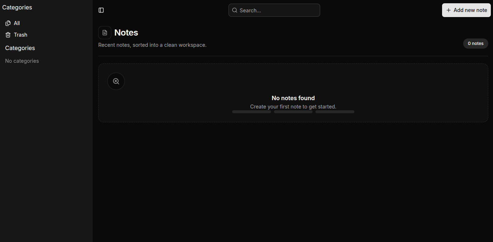
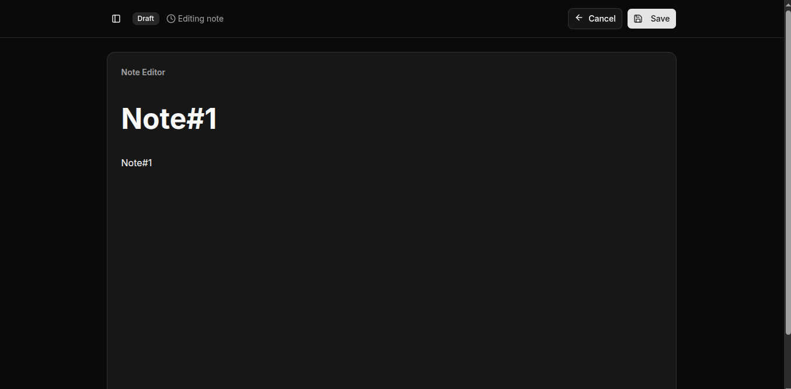

# 📝 Notes-App

A minimal notes web app built with **React + TypeScript + Vite**. Notes are stored locally in the browser (via **Zustand** persistence).





## Features

- Create notes with **title** and optional **category**
- View notes in a **grid**
- **Search** notes by title
- Filter by **category** (including a trash view)
- Open a note at `/notes/:id` and edit its content
- Delete notes (toggle to trash) and permanently delete from the trash
- Persist data across refreshes (offline-friendly)

## Tech Stack

- **Frontend:** React, TypeScript, Vite, TailwindCSS
- **Routing:** react-router-dom
- **State management:** Zustand (+ `persist` to local storage)
- **UI components:** shadcn/ui + lucide-react

## Getting Started

### Prerequisites
- Node.js (recommended: ≥ 18)
- npm

### Install

```bash
npm install
```

### Run locally

```bash
npm run dev
```

Then open the URL shown in your terminal (Vite typically uses `http://localhost:5173`).

### Build

```bash
npm run build
```

### Preview the production build

```bash
npm run preview
```

## Project Structure (high-level)

```
src/
├── components/                 # shared UI components
├── pages/
│   ├── main/                  # notes list UI (grid, header, dialogs)
│   └── Note/                  # single note page
├── stores/
│   └── notes.store.ts         # Zustand store + persistence
├── lib/                        # shared types/utilities
└── App.tsx                     # routes
```

## Roadmap

See [`TODO.md`](./TODO.md) for current planned fixes/enhancements.

## Contributing

Contributions are welcome!

1. Fork the repo
2. Create a feature branch
3. Commit your changes
4. Open a Pull Request

## License

MIT (see `LICENSE` for details).

